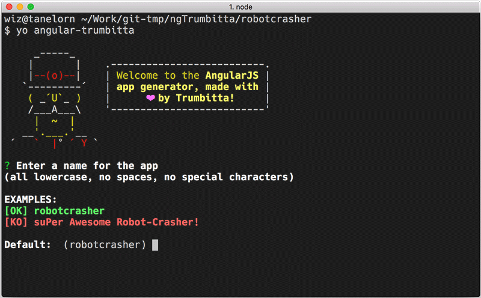

# Enterprise Angular Yeoman Generator

<!-- TOC depth:6 withLinks:1 updateOnSave:1 orderedList:0 -->

- [Enterprise Angular Yeoman Generator](#enterprise-angular-yeoman-generator)
	- [Prerequisites](#prerequisites)
	- [Install](#install)
	- [Use the generator](#use-the-generator)
	- [Use the generated application](#use-the-generated-application)
		- [TL;DR](#tldr)
		- [Directory layout](#directory-layout)
			- [Notable entries](#notable-entries)
		- [Development](#development)
			- [Naming conventions](#naming-conventions)
			- [Adding new libraries](#adding-new-libraries)
			- [Adding new source files](#adding-new-source-files)
		- [Testing](#testing)
		- [Production](#production)
		- [Grunt tasks](#grunt-tasks)
		- [Configuration](#configuration)
	- [Compatible packages](#compatible-packages)
	- [Known issues](#known-issues)
	- [License](#license)
<!-- /TOC -->



This generator is opinionated. It sums up the current state of my understanding of AngularJS best practices and patterns in an enterprise level project.

These opinions of mine cover various aspects like –but not limited to:

* Directory layout
* Naming conventions
* Grunt over Gulp, Less over SASS
* When to use a service or a factory
* The minimum usually required Bower packages
* How to separate a development workflow from a production build
* Unit testing

I like it, It works pretty fine for me. Here's hoping it'll work for
someone else, too.

Also, I'll keep on updating it as long as I keep working with Angular. So, if you feel like contributing or even discussing with me about improvements or why I'm wrong in your opinion, be my guest.

## Prerequisites

In order to use the generated AngularJS application, you'll need Grunt and Bower.

```bash
npm install -g bower grunt-cli
```

## Install

This is a [Yeoman](http://yeoman.io/) generator, so installing it is a matter of having Yeoman installed:

```bash
npm install -g yo
```

Then install the generator itself:

```bash
npm install -g generator-angular-trumbitta
```

## Use the generator

Again, just like every other Yeoman generator, you use it like this:

```bash
mkdir <yourappname> && cd <yourappname>
yo angular-trumbitta
```

You'll be asked some questions:

1. A name for your app (all lowercase, no spaces, no special characters)  
Examples:  
**[OK]** robotcrasher  
**[KO]** suPer Awesome Robot-Crasher!
2. A description (try to be meaningful, while using less than 10-15 words)  
Examples:  
**[OK]** A robot crashing app with Spaceship integrations  
**[OK]** A robot crashing app  
**[KO]** app
3. Your full name (e.g. John Smith)
4. Your email address

The generator will then proceed to run `npm install` and `bower install` for you. If either command fails, just try running it by yourself.

This step could take a while, depending on your connection speed, because involves downloading a couple heavyweight packages. Notable *offenders* are PhantomJS and Bootstrap.

The good news is that you're going to need this done the first time only.

When it's done, launch your newly created angular application to make sure everything worked out as expected:

```bash
grunt serve
```

Then point your browser at `http://localhost:9100` just to be greeted by the underwhelming *Hello world* default page.

Hit `CTRL C` if you want to stop it.

## Use the generated application

### TL;DR

1. `grunt serve`
2. Hack away while grunt watches for changes together with LiveReload
3. `grunt dist` when you are ready to deploy

*Or*, you could keep on reading and get some useful insights on how this whole thing actually works.

### Directory layout

A freshly created app will sport this directory layout:

```
.
├── .bowerrc
├── .editorconfig
├── .jscsrc
├── .jshintignore
├── .jshintrc
├── .npmignore
├── Gruntfile.js
├── README.md
├── app
│   ├── app.module.js
│   ├── app.routes.js
│   ├── components
│   │   └── home
│   │       ├── home.controller.js
│   │       ├── home.controller.spec.js
│   │       └── home.template.html
│   └── shared
│       └── config
│           ├── dev.config.json
│           ├── dist.config.json
│           └── karma.config.js
├── assets
│   ├── images
│   │   └── README.md
│   ├── js
│   │   └── README.md
│   └── less
│       ├── app-custom.less
│       └── bootstrap
│           └── overrides
│               ├── README.md
│               └── variables.less
├── bower.json
├── dist
│   └── docs
├── index.html
└── package.json
```

#### Notable entries

* Linting / coding style support with JSHint, JSCS, and EditorConfig config files
* Source files for your app resides inside `app`. There you can find two main files, `app.module.js` and `app.routes.js`, and two main directories: `components` and `shared`.
  * `app.module.js` is for the main app module (you don't say), and for any *run* or *config* block you may need.
  * `app.routes.js` is where you configure `ui.router` routes, interceptors, and so on
  * `components` is the directory where you put source files of things that can be organized in logical blocks a.k.a. *components*. One sample block, `home`, comes with the generator and as you can see it contains every part of the `home` component: a controller, a controller spec file for unit testing, and a template.
  * `shared` is where you put source files of things you plan to reuse on application-wide basis. Some custom directives, filters, general purpose services (e.g. a pagination service) usually reside here.  
  In `shared/config`, besides the configuration file for the Karma test runner, you'll find two configuration files for your app.
* `assets` contains assets like images and Less files. Customize your Bootstrap build by editing `assets/less/bootstrap/overrides`, organize your custom Less classes and imports using `assets/less/app-custom.less` as a starting point.

### Development

#### Naming conventions

#### Adding new libraries

#### Adding new source files

### Testing

### Production

### Grunt tasks

### Configuration

**TO BE EXPANDED**

`dev.config.json` is used in development (e.g. `grunt serve`), while `dist.config.json` is used in production (e.g. `grunt dist`).  
They are but stubs, samples. You are free to organize and expand them as you wish. Their contents will be available wherever you inject `app.config` and pass the `ENV` service.  
Example: `var myRESTBackend = ENV.BACKEND.URL.FULL;`

## Compatible packages

## Known issues

Until issue #12 gets fixed, you'll have to edit the `bower.json` of the generated app and change the version for the Bootstrap component from:

```
"bootstrap": "^3.3.4",
```

to:

```
"bootstrap": "3.3.4",
```

## License

MIT
